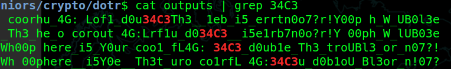

dotr -mid
========
**Category**: Crypto  **Points**: 93

Challenge Description
------
```
I implemented some crypto and encrypted my secret: 03_duCbr5e_i_rY_or cou14:L4G f313_Th_etrph00 Wh03UBl_oo?n07!_e
Can you get it back?
```

We were given the following codes

```python
import random


def encrypt(msg, key):
    keylen = len(key)
    k = [x[1] for x in sorted(zip(key[:keylen], range(keylen)))]

    m = ''
    for i in k:
        for j in range(i, len(msg), keylen):
            m += msg[j]

    return m


m = input()
while True:
    k = [random.randrange(256) for _ in range(16)]  # generate 2 keys
    if len(k) == len(set(k)):
        break

m = encrypt(m, k[:8])
m = encrypt(m, k[:8])

print(m)
```

Solution
------

The process of the program is as follows

1. Randomly generates 16 numbers between 0 and 255
2. Extract the first 8 numbers as the key
3. Associate labels 0 to 8 to the 8 numbers
4. Sort the 8 numbers and extract the labels associated
  
   Ex. [0, 2, 3, 5, 7, 6, 1, 4]
5. Use that label to determine new positions of the message
6. Encrypt twice with the same key

Knowing that the actual key used are only permutations of [0, 1, 2, 3, 4, 5, 6, 7]

We could bruteforce the combinations using the following python codes

```
import itertools

def decrypt(msg, key):
  k = key
  keylen = len(k)
  m = ['']*len(msg)
  tmp = msg

  for i in k:
        for j in range(i, len(msg), keylen):
            m[j] = tmp[0]
            tmp = tmp[1:]
  return ''.join(m)

m = input()
keysets = [0, 1, 2, 3, 4, 5, 6, 7]
# Loop through all the keys
for key in itertools.permutations(keysets):
   tmp = m
   tmp = decrypt(tmp, list(key))
   tmp = decrypt(tmp, list(key))
   print(tmp)
```
Note: The jth index is the original position in the decrypted message, we could retrieve that character
by popping off the first character in the encrypted message each iteration.

Redirecting the output to a file we could grep some possible letters of the flag such as 34C3, fL4G



Flag: 34C3_d0ub1e_Th3_troUBl3_or_n07?!
