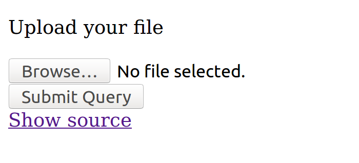

upload - easy
========
**Category**: web  **Points**: 48

Challenge Description
------------
```
This is an useful service to unzip some files.

We added a flag for your convenience.
```
We were presented with the website



The source: 
```php
 <?php
$UPLOADS = '/var/www/uploads/';
if(!empty($_FILES['uploaded_file'])) {
    $paths = scandir($UPLOADS);
    $now = time();
    foreach($paths as $path) {
        if ($path == '.') {
            continue;
        }
        $mtime = filemtime($UPLOADS . $path);
        if ($now - $mtime > 120) {
            shell_exec('rm -rf ' . $UPLOADS . $path);
        }
    }
    $path = $UPLOADS . uniqid('upl') . '/';
    if(!mkdir($path, 0777, true)) {
        die('mkdir failed');
    }
    $zip = $path . uniqid('zip');
    if(move_uploaded_file($_FILES['uploaded_file']['tmp_name'], $zip)) {
        shell_exec('unzip -j -n ' . $zip . ' -d ' . $path);
        unlink($zip);
        header('Location: uploads/'. basename($path) . '/');
    } else {
        echo 'There was an error uploading the file, please try again!';
    }
} else {
?>
<!DOCTYPE html>
<html>
<head>
    <title>Upload your files</title>
</head>
<body>
<?php
    if (@$_GET['source']) {
        highlight_file(__FILE__);
    } else {
?>
    <form enctype="multipart/form-data" method="POST">
        <p>Upload your file</p>
        <input type="file" name="uploaded_file"></input><br />
        <input type="submit"></input>
    </form>
    <a href="?source=1">Show source</a>
</body>
</html>
<?php
    }
}
?> 

```
We were also given the flag.php under the website, it's just a blank page.

Solution
-------

Actually I had no idea of zip symlink attack before. So I had to google it and this website clearly explains the methods.
https://security.stackexchange.com/questions/73718/how-zip-symlink-works

This site pretty much gave away all the answers so I just had to

```
ln -s /var/www/flag.php symlink.txt
```
and zip it, uploading it and opening the txt we get the flag.

Flag: 34C3_unpack_th3_M1ss1ng_l!nk
