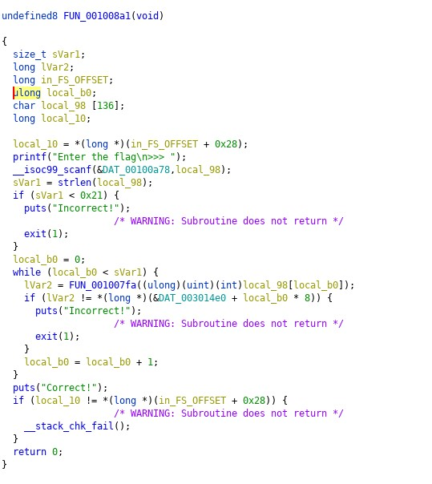
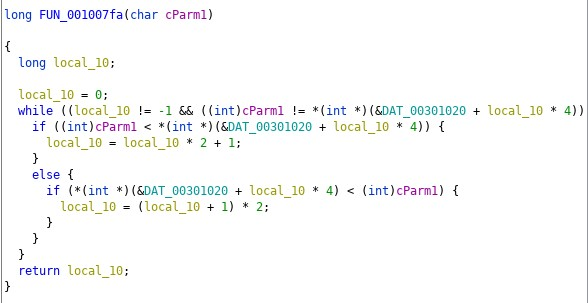
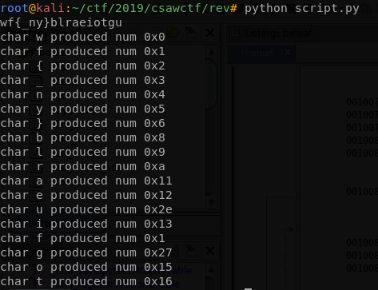

beleaf
===========
**Category**: rev  **Points**: 50

Challenge Description
-------------
We are given a binary file `beleaf`.

Solution
--------------

Opening the file in ghidra, we can examine the main function



It basically goes through the input string char by char, execute FUN_001007fa() on that char and compare it against the values stored at DAT_003014e0.

The following shows the function operated on each char.



The python equivalent would be

```python
def secret_process(c):
    num = 0
    while(num != -1 and ord(c)!=ord(constant[num])):
        if ord(c) < ord(constant[num]):
            num = num*2 + 1
        elif ord(c) > ord(constant[num]):
            num = (num+1)*2
    return num
```
We can see that by inputting the same char the output will always stay the same. Since we have the inputs (DAT_0030120), the function that processes each input char (FUN_001007fa) and the exact output (DAT_003014e0), we can just map each potential char to a value by running the above function.



Now we get the essential elements for reversing as follows

1. inputs @ DAT_0030120 (copied from ghidra's byte view):
    ```python
    >>> s = "77 00 00 00 66 00 00 00 7b 00 00 00 5f 00 00 00 6e 00 00 00 79 00 00 00 7d 00 00 00 ff ff ff ff 62 00 00 00 6c 00 00 00 72 00 00 00 ff ff ff ff ff ff ff ff ff ff ff ff ff ff ff ff ff ff ff ff ff ff ff ff 61 00 00 00 65 00 00 00 69 00 00 00 ff ff ff ff 6f 00 00 00 74 00 00 00 ff ff ff ff ff ff ff ff ff ff ff ff ff ff ff ff ff ff ff ff ff ff ff ff ff ff ff ff ff ff ff ff ff ff ff ff ff ff ff ff ff ff ff ff ff ff ff ff ff ff ff ff ff ff ff ff ff ff ff ff ff ff ff ff 67 00 00 00 ff ff ff ff ff ff ff ff ff ff ff ff ff ff ff ff ff ff ff ff ff ff ff ff 75 00 00 00 ff ff ff ff ff ff ff ff ff ff ff ff ff ff ff ff ff ff ff ff ff ff ff ff ff ff ff ff ff ff ff ff ff ff ff ff ff ff ff ff ff ff ff ff ff ff ff ff ff ff ff ff ff ff ff ff ff ff ff ff ff ff ff ff ff ff ff ff ff ff ff ff ff ff ff ff ff ff ff ff ff ff ff ff ff ff ff ff ff ff ff ff ff ff ff ff ff ff ff ff ff ff ff ff ff ff ff ff ff ff ff ff ff ff ff ff ff ff ff ff ff ff ff ff ff ff ff ff ff ff ff ff ff ff ff ff ff ff ff ff ff ff ff ff ff ff ff ff ff ff ff ff ff ff ff ff ff ff ff ff ff ff ff ff ff ff ff ff ff ff ff ff ff ff ff ff ff ff ff ff ff ff ff ff ff ff ff ff ff ff ff ff ff ff ff ff ff ff ff ff ff ff ff ff ff ff ff ff ff ff ff ff ff ff ff ff ff ff ff ff ff ff ff ff ff ff ff ff ff ff ff ff ff ff ff ff ff ff ff ff ff ff ff ff ff ff ff ff ff ff ff ff ff ff ff ff ff ff ff ff ff ff ff ff ff ff ff ff ff ff ff ff ff ff ff ff ff ff ff ff ff ff ff ff ff ff ff ff ff ff ff ff ff ff ff ff ff ff ff ff ff ff ff ff ff ff ff ff ff ff ff ff ff ff ff ff ff ff ff ff ff ff ff ff ff ff ff ff ff ff ff ff ff ff ff ff ff ff ff ff ff ff ff ff ff ff ff ff ff ff ff ff ff ff ff ff ff ff ff ff ff ff ff ff ff ff ff ff ff ff ff ff ff ff ff ff ff ff ff ff ff ff ff ff ff ff ff ff ff ff ff ff ff ff ff ff ff ff ff ff ff ff ff ff ff ff ff ff ff ff ff ff ff ff ff ff ff ff ff ff ff ff ff ff ff ff ff ff ff ff ff ff ff ff ff ff ff ff ff ff ff ff ff ff ff ff ff ff ff ff ff ff ff ff ff ff ff ff ff ff ff ff ff ff ff ff ff ff ff ff ff ff ff ff ff ff ff ff ff ff ff ff ff ff ff ff ff ff ff ff ff ff ff ff ff ff ff ff ff ff ff ff ff ff ff ff ff ff ff ff ff ff ff ff ff ff ff ff ff ff ff ff ff ff ff ff ff ff ff ff ff ff ff ff ff ff ff ff ff ff ff ff ff ff ff ff ff ff ff ff ff ff ff ff ff ff ff ff ff ff ff ff ff ff ff ff ff ff ff ff ff ff ff ff ff ff ff ff ff ff ff ff ff ff ff ff ff ff ff ff ff ff ff ff ff ff ff ff ff ff ff ff ff ff ff ff ff ff ff ff ff ff ff ff ff ff ff ff ff ff ff ff ff ff ff ff ff ff ff ff ff ff ff ff ff ff ff ff ff ff ff ff ff ff ff ff ff ff ff ff ff ff ff ff ff ff ff ff ff ff ff ff ff ff ff ff ff ff ff ff ff ff ff ff ff ff ff ff ff ff ff ff ff ff ff ff ff ff ff ff ff ff ff ff ff ff ff ff ff ff ff ff ff ff ff ff ff ff ff ff ff ff ff ff ff ff ff ff ff ff ff ff ff ff ff ff ff ff ff ff ff ff ff ff ff ff ff ff ff ff ff ff ff ff ff ff ff ff ff ff ff ff ff ff ff ff ff ff ff ff ff ff ff ff ff ff ff ff ff ff ff ff ff ff ff ff ff ff ff ff ff ff ff ff ff ff ff ff ff ff ff ff ff ff ff ff ff ff ff ff ff ff ff ff ff ff ff ff ff ff ff ff ff ff ff ff ff ff ff ff ff ff ff ff ff ff ff ff ff ff ff ff ff ff ff ff ff ff ff ff ff ff ff ff ff ff ff ff ff ff ff ff ff ff ff ff ff ff ff ff ff ff ff ff ff ff ff ff ff ff ff ff ff ff ff ff ff ff ff ff ff ff ff ff ff ff ff ff ff ff ff ff ff ff ff ff ff ff ff ff ff ff ff ff ff ff ff ff ff ff ff ff ff ff ff ff ff ff ff ff ff ff ff ff ff ff ff ff ff ff ff ff ff ff ff ff ff ff ff ff ff ff ff ff ff ff ff ff ff ff ff ff ff ff ff ff ff ff ff ff ff ff ff ff ff ff ff ff ff ff ff ff ff ff ff ff ff ff ff ff ff ff ff ff ff ff ff ff ff ff ff ff ff ff ff ff ff ff ff ff ff ff ff ff ff ff ff ff ff ff ff ff"
    >>> ''.join([chr(int(s.split(' ')[i],16)) for i in xrange(len(s.split(' '))) if i%4 == 0])
    'wf{_ny}\xffblr\xff\xff\xff\xff\xff\xffaei\xffot\xff\xff\xff\xff\xff\xff\xff\xff\xff\xff\xff\xff\xff\xff\xff\xffg\xff\xff\xff\xff\xff\xffu\xff\xff\xff\xff\xff\xff\xff\xff\xff\xff\xff\xff\xff\xff\xff\xff\xff\xff\xff\xff\xff\xff\xff\xff\xff\xff\xff\xff\xff\xff\xff\xff\xff\xff\xff\xff\xff\xff\xff\xff\xff\xff\xff\xff\xff\xff\xff\xff\xff\xff\xff\xff\xff\xff\xff\xff\xff\xff\xff\xff\xff\xff\xff\xff\xff\xff\xff\xff\xff\xff\xff\xff\xff\xff\xff\xff\xff\xff\xff\xff\xff\xff\xff\xff\xff\xff\xff\xff\xff\xff\xff\xff\xff\xff\xff\xff\xff\xff\xff\xff\xff\xff\xff\xff\xff\xff\xff\xff\xff\xff\xff\xff\xff\xff\xff\xff\xff\xff\xff\xff\xff\xff\xff\xff\xff\xff\xff\xff\xff\xff\xff\xff\xff\xff\xff\xff\xff\xff\xff\xff\xff\xff\xff\xff\xff\xff\xff\xff\xff\xff\xff\xff\xff\xff\xff\xff\xff\xff\xff\xff\xff\xff\xff\xff\xff\xff\xff\xff\xff\xff\xff\xff\xff\xff\xff\xff\xff\xff\xff\xff\xff\xff\xff\xff\xff\xff\xff\xff\xff\xff\xff\xff\xff\xff\xff\xff\xff\xff\xff\xff\xff\xff\xff\xff\xff\xff\xff\xff\xff\xff\xff\xff\xff\xff\xff\xff\xff\xff\xff\xff\xff\xff\xff\xff\xff\xff\xff\xff\xff\xff\xff\xff\xff\xff\xff\xff\xff\xff\xff\xff\xff\xff\xff\xff\xff\xff\xff\xff\xff\xff\xff\xff\xff'
    >>> 

    ```
2. outputs @ DAT_003014e0
    ```python
    >>> s = "01 00 00 00 00 00 00 00 09 00 00 00 00 00 00 00 11 00 00 00 00 00 00 00 27 00 00 00 00 00 00 00 02 00 00 00 00 00 00 00 00 00 00 00 00 00 00 00 12 00 00 00 00 00 00 00 03 00 00 00 00 00 00 00 08 00 00 00 00 00 00 00 12 00 00 00 00 00 00 00 09 00 00 00 00 00 00 00 12 00 00 00 00 00 00 00 11 00 00 00 00 00 00 00 01 00 00 00 00 00 00 00 03 00 00 00 00 00 00 00 13 00 00 00 00 00 00 00 04 00 00 00 00 00 00 00 03 00 00 00 00 00 00 00 05 00 00 00 00 00 00 00 15 00 00 00 00 00 00 00 2e 00 00 00 00 00 00 00 0a 00 00 00 00 00 00 00 03 00 00 00 00 00 00 00 0a 00 00 00 00 00 00 00 12 00 00 00 00 00 00 00 03 00 00 00 00 00 00 00 01 00 00 00 00 00 00 00 2e 00 00 00 00 00 00 00 16 00 00 00 00 00 00 00 2e 00 00 00 00 00 00 00 0a 00 00 00 00 00 00 00 12 00 00 00 00 00 00 00 06 00 00 00 00 00 00 00"
    >>> ["0x"+s.split(' ')[i] for i in xrange(len(s.split(' '))) if i%8 == 0]
    ['0x01', '0x09', '0x11', '0x27', '0x02', '0x00', '0x12', '0x03', '0x08', '0x12', '0x09', '0x12', '0x11', '0x01', '0x03', '0x13', '0x04', '0x03', '0x05', '0x15', '0x2e', '0x0a', '0x03', '0x0a', '0x12', '0x03', '0x01', '0x2e', '0x16', '0x2e', '0x0a', '0x12', '0x06']
    >>>
    ```
3. Now we can run the script and get the flag
    ``` python
    potential_input = "wf{_ny}blraeuifgot"
    constant = 'wf{_ny}\xffblr\xff\xff\xff\xff\xff\xffaei\xffot\xff\xff\xff\xff\xff\xff\xff\xff\xff\xff\xff\xff\xff\xff\xff\xffg\xff\xff\xff\xff\xff\xffu\xff\xff\xff\xff\xff\xff\xff\xff\xff\xff\xff\xff\xff\xff\xff\xff\xff\xff\xff\xff\xff\xff\xff\xff\xff\xff\xff\xff\xff\xff\xff\xff\xff\xff\xff\xff\xff\xff\xff\xff\xff\xff\xff\xff\xff\xff\xff\xff\xff\xff\xff\xff\xff\xff\xff\xff\xff\xff\xff\xff\xff\xff\xff\xff\xff\xff\xff\xff\xff\xff\xff\xff\xff\xff\xff\xff\xff\xff\xff\xff\xff\xff\xff\xff\xff\xff\xff\xff\xff\xff\xff\xff\xff\xff\xff\xff\xff\xff\xff\xff\xff\xff\xff\xff\xff\xff\xff\xff\xff\xff\xff\xff\xff\xff\xff\xff\xff\xff\xff\xff\xff\xff\xff\xff\xff\xff\xff\xff\xff\xff\xff\xff\xff\xff\xff\xff\xff\xff\xff\xff\xff\xff\xff\xff\xff\xff\xff\xff\xff\xff\xff\xff\xff\xff\xff\xff\xff\xff\xff\xff\xff\xff\xff\xff\xff\xff\xff\xff\xff\xff\xff\xff\xff\xff\xff\xff\xff\xff\xff\xff\xff\xff\xff\xff\xff\xff\xff\xff\xff\xff\xff\xff\xff\xff\xff\xff\xff\xff\xff\xff\xff\xff\xff\xff\xff\xff\xff\xff\xff\xff\xff\xff\xff\xff\xff\xff\xff\xff\xff\xff\xff\xff\xff\xff\xff\xff\xff\xff\xff\xff\xff\xff\xff\xff\xff\xff\xff\xff\xff\xff\xff\xff\xff\xff\xff\xff\xff\xff\xff\xff\xff\xff\xff'

    values = ['0x01', '0x09', '0x11', '0x27', '0x02', '0x00', '0x12', '0x03', '0x08', '0x12', '0x09', '0x12', '0x11', '0x01', '0x03', '0x13', '0x04', '0x03', '0x05', '0x15', '0x2e', '0x0a', '0x03', '0x0a', '0x12', '0x03', '0x01', '0x2e', '0x16', '0x2e', '0x0a', '0x12', '0x06']

    def secret_process(c):
        num = 0
        while(num != -1 and ord(c)!=ord(constant[num])):
            if ord(c) < ord(constant[num]):
                num = num*2 + 1
            elif ord(c) > ord(constant[num]):
                num = (num+1)*2
        return num

    value_pair = {}

    for i in potential_input:
        num = secret_process(i)
        value_pair[str(format(num, "#04x"))] = i
        #print("char %c produced num 0x%x" % (i, num))

    flag = []

    for i in values:
        flag += value_pair[i]

    print ''.join(flag)

    ```
The flag is: `flag{we_beleaf_in_your_re_future}`
