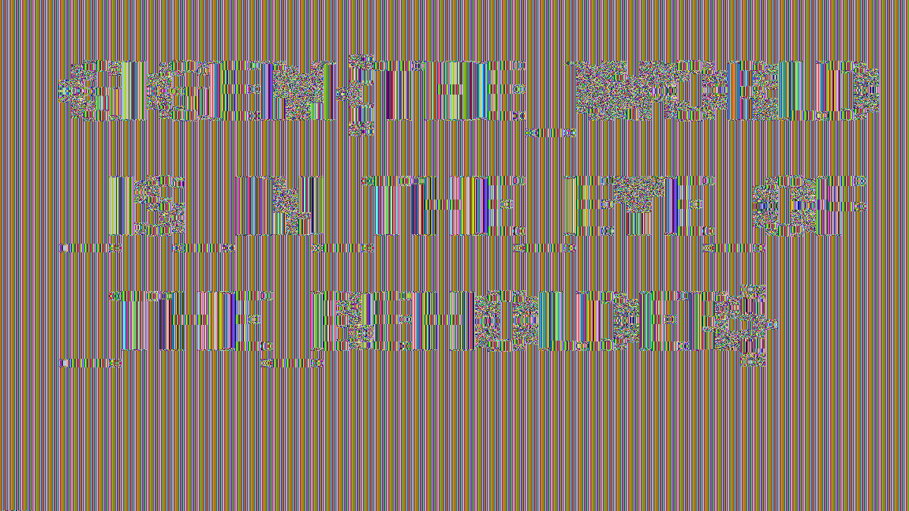
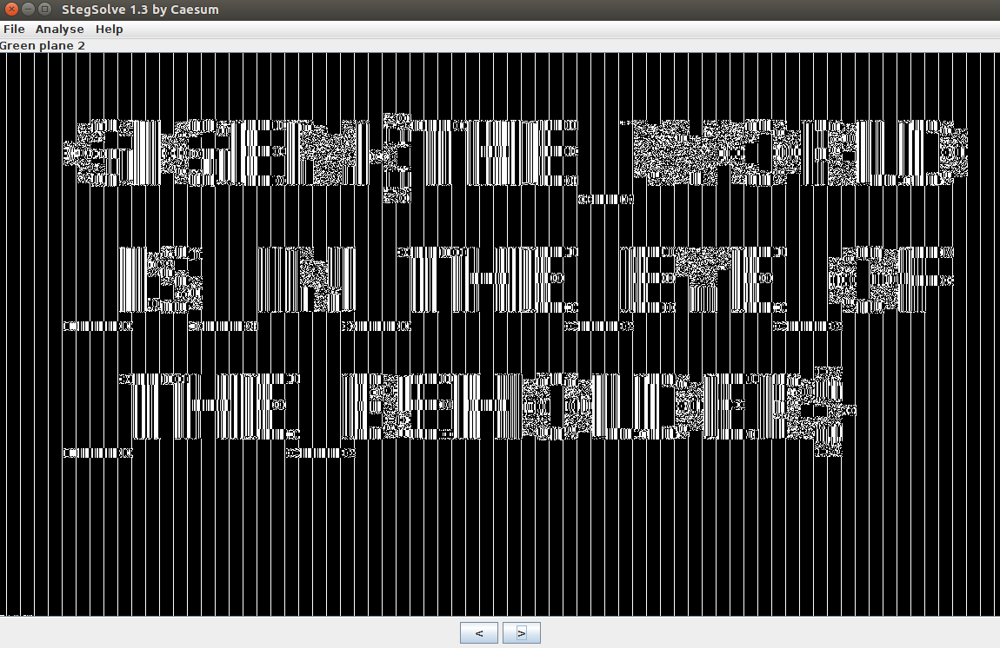

Image'n That
========
**Category**: Crypto  **Points**: 25

Challenge Description
------
```
My buddy claims that the safest way to encrypt his secret images with the secure AES-ECB algorithm. 
Can you prove him wrong?
```


Solutions
-----------------

Images encrypted with AES-ECB are insecure, and you could even see parts of the images.

I didn't find a way to decrypt the images though it seems to be a easy challenge? However, I used some stego tools to view
the flag.



Flag: GIGEM{THE_WORLD_IS_IN_THE_EYE_OF_THE_BEHOLDER}
