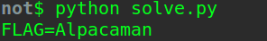

readyXORnot
========
**Category**: Crypto  **Points**: 15

Challenge Description
------
```
original data: "El Psy Congroo"
encrypted data: "IFhiPhZNYi0KWiUcCls="
encrypted flag: "I3gDKVh1Lh4EVyMDBFo="

The flag is not in the traditional gigem{flag} format.
```

Solutions
------------------
The flag is encrpted with xor, so a simple script that base64 decodes the encrypted flag and xor with the key should do the trick.

```python
import base64

data = "El Psy Congroo"
data_enc = base64.b64decode("IFhiPhZNYi0KWiUcCls=")
flag_enc = base64.b64decode("I3gDKVh1Lh4EVyMDBFo=")

key = ''.join([chr(ord(x)^ord(y)) for x, y in zip(data, data_enc)])
flag = ''.join([chr(ord(x)^ord(y)) for x, y in zip(flag_enc, key)])
print flag
```



Flag: Alpacaman
