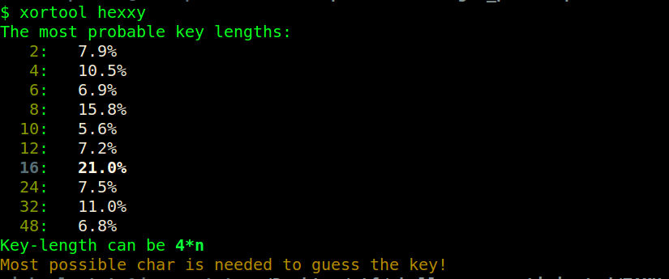
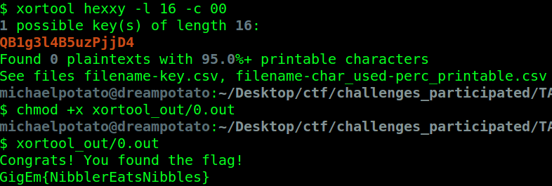

XORBytes
==========
**Category**: Crypto  **Points**: 100

Challenge Description
------
```
Looks like there is a flag here...if only you could run the binary.
```
We were given a binary file with unknown data type. Judging by the name of this challenge
the file should be xor encrypted.

Solutions
-----------

Instead of writing my own codes, I used the xortool.

`xortool hexxy`



We now know the key length is 16, what a useful tool!

`xortool hexxy -l 16 -c 00`



Flag: GigEm{NibblerEatsNibbles}
