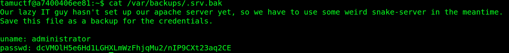
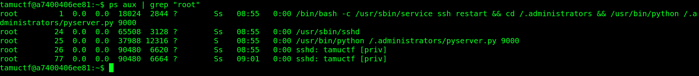
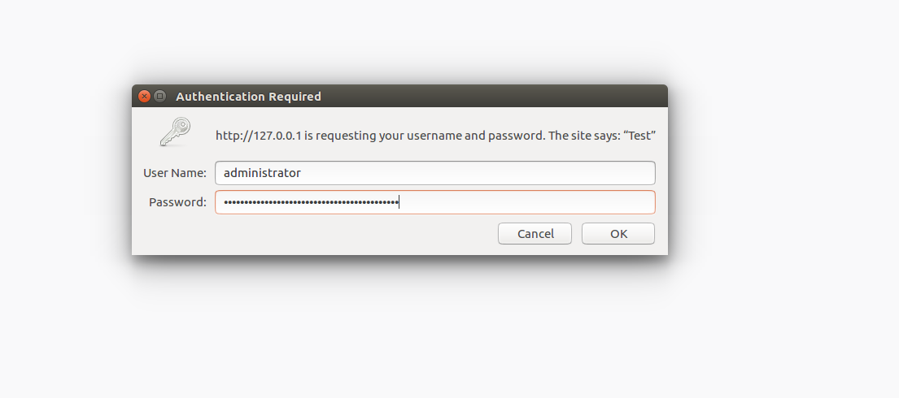
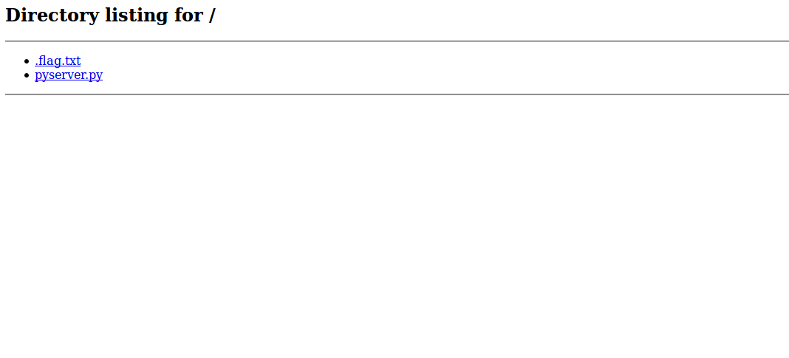

Enum
==============
**Category**: Misc  **Points**: 150

Challenge Description
------
```
Find the hidden flag.
You do not need to bruteforce. Don't do it.

ssh tamuctf@shell2.ctf.tamu.edu -p 2222
password: tamuctf
```

Solutions
----------

This challenges feels like the sort of hackthebox machines and I really enjoyed it.



It looks like we got some creds and a python server is running



We found the server on localhost listening on port 9000

Time to do some research how to ssh to another port, it turns out we could use port forwarding

`ssh -L 80:localhost:9000 tamuctf@shell2.ctf.tamu.edu -p 2222`





And there is our flag!

Flag: gigem{pivot_piv0t_P1V0T_20975430987aff92qf89qf}
