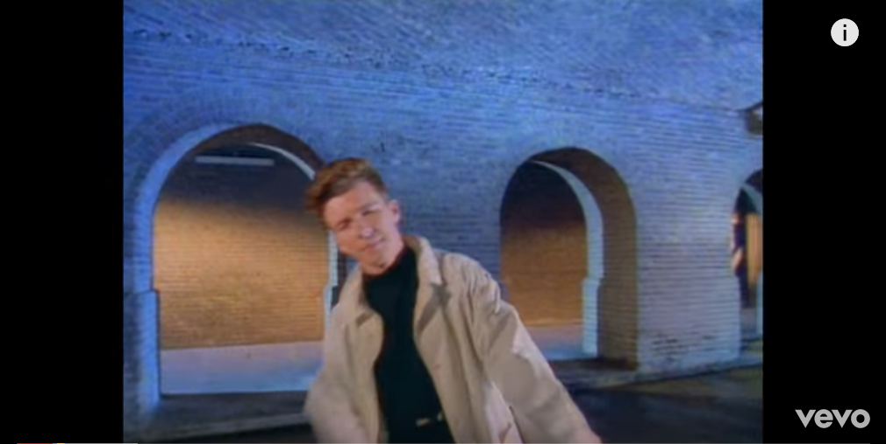

Dance
===================
**Category**: Web  **Points**: 150

Challenge Description
------

```
http://dance.wpictf.xyz/
```

Solutions
----------
Navigating to the website, we are redirected to a youtube video (Rick Rolled...)



Open up in Burp, we saw a cookie being set, the flag was null the first two times I tried, but the third time I got something 
interesting.
```
flag=E1KSn2SSktOcG2AeV3WdUQAoj24fm19xVGmomMSoH3SuHEAuG2WxHDuSIF5wIGW9MZx=; Julius c.="got good dance moves."
```
The flag base64 decoded to gibberish and I couldn't find any other encoding scheme being used. So I decided to focus on the second
 cookie, just by googling "Julius C got good dance moves", I came across a song called `Move` (Not sure if this is the clue 
 but it was a clue for me XD)
 
 I Caesarian Shifted it until 17 and the flag was decoded successfully
 
 `flag: WPI{bInAm_do3sn,t_kn0w_h1w_t2_creaTe_chaIIenges} `
 
 
